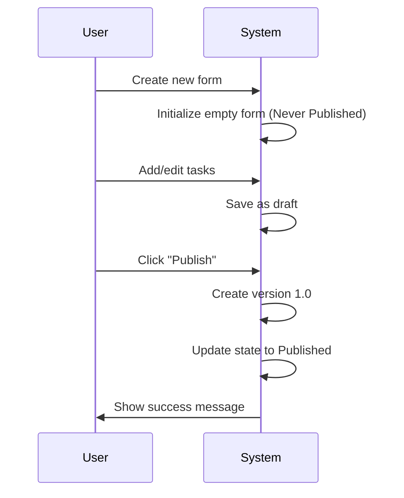
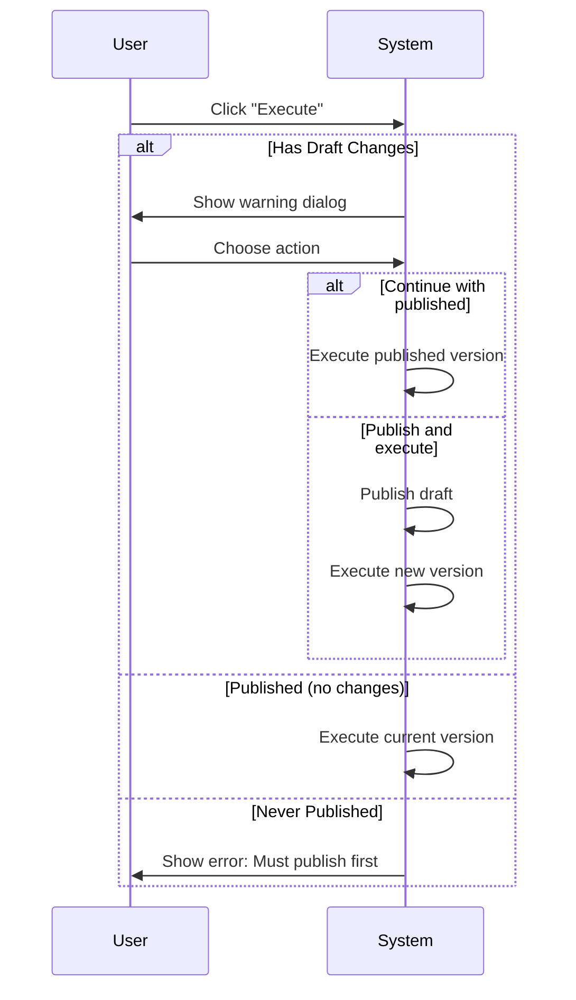
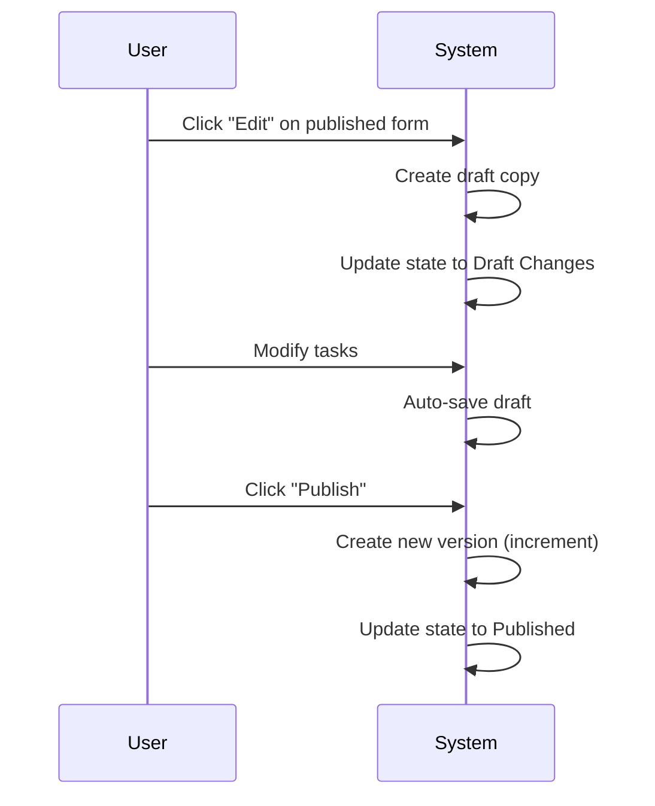

# Form Lifecycle Management System

## Overview

This document describes the generic form lifecycle management system that provides consistent version control, publishing workflows, and execution management across different entity types (routines, inspections, quality checks, etc.). The system is designed to be entity-agnostic while maintaining strict version control and audit trails.

## Core Principles

1. **Entity Agnostic**: The same lifecycle applies to any entity using forms
2. **Latest Version Execution**: Only the most recent published version can be executed
3. **Immutable Versions**: Published versions cannot be modified
4. **Clear State Management**: Users always know the state of their forms
5. **Audit Trail**: Complete history of all versions and changes

## Form States

### 1. Never Published (Initial State)
- **Description**: Form exists but has never been published
- **Visual Indicator**: Red badge with "Não Publicado"
- **Capabilities**:
  - ✅ Can edit form tasks
  - ❌ Cannot execute
  - ✅ Can delete entire form
- **User Actions**: Edit Form, Delete Form

### 2. Published (Stable State)
- **Description**: Form has at least one published version, no pending changes
- **Visual Indicator**: Green badge with version number (e.g., "v1.2")
- **Capabilities**:
  - ✅ Can execute current version
  - ✅ Can create new draft for editing
  - ✅ Can view version history
  - ❌ Cannot delete (has execution history)
- **User Actions**: Execute, Edit (creates draft), View History

### 3. Draft Changes (Transitional State)
- **Description**: Published form with unpublished modifications
- **Visual Indicator**: Orange badge "v1.2 com alterações"
- **Capabilities**:
  - ✅ Can execute last published version
  - ✅ Can continue editing draft
  - ✅ Can publish draft as new version
  - ✅ Can discard draft changes
- **User Actions**: Execute (with warning), Continue Editing, Publish, Discard Draft

## State Transitions

```
[Never Published] --Publish--> [Published]
[Published] --Edit--> [Draft Changes]
[Draft Changes] --Publish--> [Published] (new version)
[Draft Changes] --Discard--> [Published] (same version)
```

## Visual Design System

### Status Badges

```typescript
interface FormStatusBadge {
  state: 'unpublished' | 'published' | 'draft';
  version?: string;
  lastPublished?: Date;
  modifiedAt?: Date;
}
```

**Badge Examples:**
- 🔴 `Não Publicado` - Never published
- 🟢 `v1.0` - Published, no changes
- 🟠 `v1.0 com alterações` - Has draft changes
- 🔵 `v2.1 (atual)` - Latest published version

### List Item Display

```
┌─────────────────────────────────────────────────────────┐
│ [Icon] Form Name                          [Status Badge] │
│ Entity: Routine/Inspection                               │
│ Last Published: 3 days ago by Maria Silva               │
│ Version: 1.2 | Tasks: 15 (12 obrigatórias)             │
│                                                         │
│ [Execute] [Edit] [History] [⋮ More]                    │
└─────────────────────────────────────────────────────────┘
```

## User Workflows

### 1. Creating and Publishing First Version



### 2. Executing a Form



### 3. Editing Published Form



## Component Architecture

### 1. FormStatusBadge Component

```typescript
interface FormStatusBadgeProps {
  form: {
    id: number;
    current_version_id: number | null;
    has_draft_changes: boolean;
    current_version?: {
      version_number: string;
      published_at: string;
    };
  };
  size?: 'sm' | 'md' | 'lg';
  showDetails?: boolean;
}
```

### 2. FormExecutionGuard Component

```typescript
interface FormExecutionGuardProps {
  form: Form;
  onExecute: (versionId: number) => void;
  onPublishAndExecute?: () => void;
  children: React.ReactNode;
}
```

### 3. FormVersionHistory Component

```typescript
interface FormVersionHistoryProps {
  formId: number;
  currentVersionId: number;
  onVersionCompare?: (v1: number, v2: number) => void;
  onVersionPreview?: (versionId: number) => void;
}
```

## Implementation Guidelines

### 1. Entity Integration

Each entity (routine, inspection, etc.) should:
- Include form relationship with version tracking
- Implement standard form lifecycle hooks
- Use shared components for consistency
- Maintain entity-specific business logic separately

### 2. API Endpoints

Standard endpoints for any entity with forms:
- `GET /api/{entity}/{id}/form` - Get form with current state
- `POST /api/{entity}/{id}/form/tasks` - Save draft tasks
- `POST /api/{entity}/{id}/form/publish` - Publish new version
- `GET /api/{entity}/{id}/form/versions` - List all versions
- `POST /api/{entity}/{id}/form/discard-draft` - Discard changes

### 3. State Management

```typescript
interface FormState {
  id: number;
  entity_type: 'routine' | 'inspection' | 'quality_check';
  entity_id: number;
  current_version_id: number | null;
  has_draft_changes: boolean;
  draft_tasks?: Task[];
  current_version?: FormVersion;
  versions?: FormVersion[];
}
```

### 4. Permissions

- **View**: Can see form and version history
- **Edit**: Can create/modify drafts
- **Publish**: Can publish new versions
- **Execute**: Can execute published versions
- **Delete**: Can delete unpublished forms

## UI Components Library

### Shared Components

1. **FormStatusBadge**: Displays current form state
2. **FormExecutionGuard**: Handles execution logic with warnings
3. **FormVersionHistory**: Shows version timeline
4. **FormTaskEditor**: Generic task editing interface
5. **FormPublishDialog**: Confirmation and changelog input
6. **FormDraftWarning**: Warning banner for draft states

### Usage Example

```tsx
// In any entity component (Routine, Inspection, etc.)
<FormLifecycleWrapper
  entity={routine}
  entityType="routine"
  onExecute={handleExecute}
  onEdit={handleEdit}
>
  {(formState, actions) => (
    <>
      <FormStatusBadge form={formState} />
      <FormActionButtons
        state={formState}
        onExecute={actions.execute}
        onEdit={actions.edit}
        onPublish={actions.publish}
        onHistory={actions.showHistory}
      />
    </>
  )}
</FormLifecycleWrapper>
```

## Migration Strategy

For existing implementations:

1. **Phase 1**: Add status badges and visual indicators
2. **Phase 2**: Implement execution guards and warnings
3. **Phase 3**: Add version history and management
4. **Phase 4**: Standardize API and components

## Best Practices

1. **Always show form state clearly** - Users should never guess
2. **Confirm destructive actions** - Especially discarding drafts
3. **Auto-save drafts** - Prevent data loss
4. **Log all state changes** - Maintain audit trail
5. **Graceful degradation** - Handle missing versions elegantly
6. **Consistent terminology** - Use same terms across all entities

## Error Handling

### Common Scenarios

1. **Attempting to execute unpublished form**
   - Show clear error message
   - Provide action to edit/publish

2. **Concurrent editing conflicts**
   - Detect when draft is outdated
   - Offer merge or overwrite options

3. **Publishing failures**
   - Maintain draft state
   - Show specific error reason
   - Allow retry

4. **Missing version data**
   - Fallback to safe defaults
   - Log for investigation
   - Don't block user workflow

## Performance Considerations

1. **Lazy load version history** - Only when requested
2. **Cache current version** - Reduce API calls
3. **Debounce auto-save** - Prevent excessive saves
4. **Paginate version lists** - For forms with many versions
5. **Optimize status queries** - Include in entity list queries

## Future Enhancements

1. **Version branching** - Multiple active versions
2. **Scheduled publishing** - Publish at specific time
3. **Approval workflows** - Require approval before publish
4. **Version templates** - Start from previous version
5. **Bulk operations** - Publish multiple forms at once
6. **Change notifications** - Alert users of new versions
7. **Version pinning** - Lock specific version for entity

## Conclusion

This generic form lifecycle management system provides a consistent, user-friendly approach to version control across all entities that use forms. By following these guidelines, we ensure that users have a clear understanding of form states, can confidently execute the correct versions, and maintain a complete audit trail of all changes. 