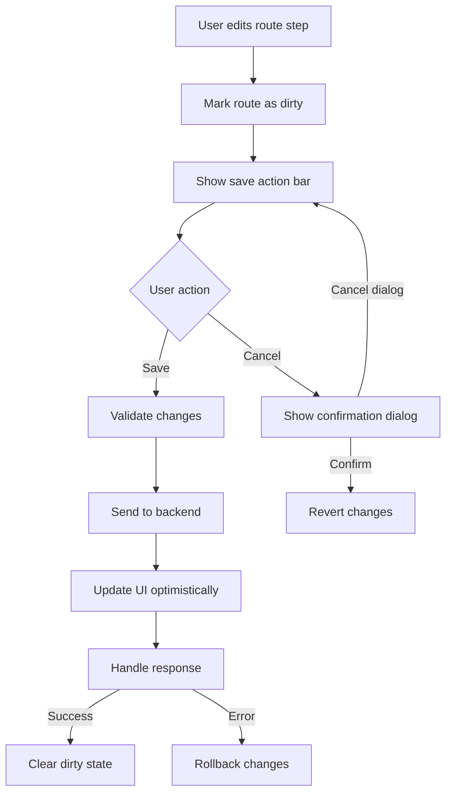
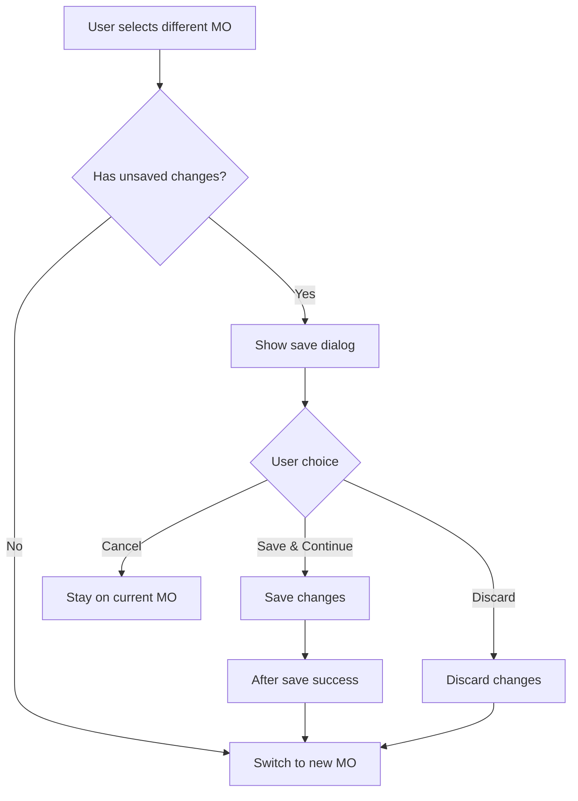
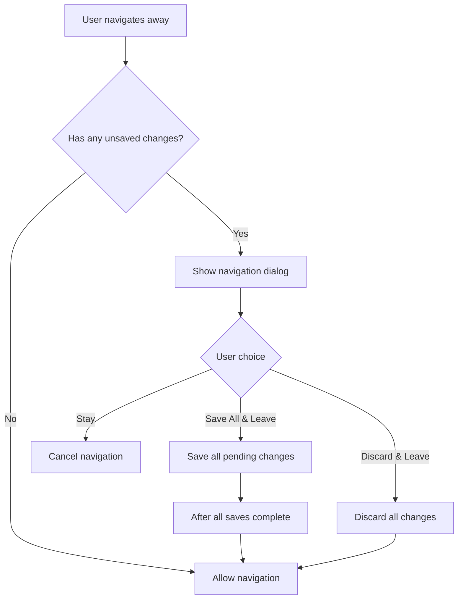

# Manual Save Refactor Specification

## Executive Summary

This document outlines the complete specification for refactoring the current auto-save functionality in the production planning module to a manual save approach. The new system will provide explicit user control over when changes are saved, with clear visual feedback and prevention of accidental data loss.

## Current System Analysis

### Auto-Save Implementation
- **Location**: `resources/js/components/production/planning/RouteBuilder.tsx`
- **Mechanism**: Debounced auto-save triggers 1.5 seconds after last change
- **Issues**:
  - Focus loss during saves due to component re-renders
  - Changes made during save requests are overwritten
  - No user control over when saves occur
  - Potential for incomplete saves if user navigates away quickly

### Current Data Flow
1. User makes changes to route steps or MO priorities
2. Changes trigger auto-save after 1.5 second delay
3. Backend saves data and returns updated IDs
4. Component re-renders with new data, causing focus loss
5. No explicit confirmation of successful saves

## New Manual Save Architecture

### Core Principles

1. **Explicit User Control**: All saves require user action
2. **Clear Visual Feedback**: Visible dirty state indicators
3. **Data Loss Prevention**: Warnings before navigation with unsaved changes
4. **Atomic Operations**: Save all changes or none
5. **Optimistic Updates**: UI reflects changes immediately
6. **Focus Preservation**: Maintain user context during saves

### Visual Design

#### 1. Route Builder Save Controls
When changes are made to route steps:
- A floating action bar appears at the top of the route steps
- Contains "Cancel" and "Save" buttons
- Pushes route content down smoothly with animation
- Shows count of unsaved changes

```
┌─────────────────────────────────────────────────┐
│  ⚠️ 3 unsaved changes                           │
│  [Cancel]                           [Save Route] │
└─────────────────────────────────────────────────┘
│                                                 │
│  Step 1: Preparation                            │
│  Step 2: Assembly                               │
│  ...                                            │
```

#### 2. MO Hierarchy Save Controls
When changes are made to MO priorities:
- Similar floating action bar appears above the MO tree
- Independent from route save controls
- Can have both MO and route changes pending simultaneously

```
┌─────────────────────────────────────────────────┐
│  ⚠️ 2 MO priority changes                       │
│  [Cancel]                             [Save MOs] │
└─────────────────────────────────────────────────┘
│                                                 │
│  📦 MO-2024-001 [Priority: 85]                  │
│  └── 📦 MO-2024-002 [Priority: 70]              │
```

### Component Architecture

#### 1. Enhanced PlanningPage Component
```typescript
interface PlanningPageState {
  // Route changes tracking
  routeChanges: Map<number, RouteChange>;
  hasRouteChanges: boolean;
  
  // MO changes tracking
  moChanges: Map<number, MOChange>;
  hasMOChanges: boolean;
  
  // Save states
  savingRoute: boolean;
  savingMOs: boolean;
}

interface RouteChange {
  orderId: number;
  steps: RouteStep[];
  originalSteps: RouteStep[];
  timestamp: Date;
}

interface MOChange {
  orderId: number;
  priority: number;
  originalPriority: number;
  timestamp: Date;
}
```

#### 2. New SaveActionBar Component
```typescript
interface SaveActionBarProps {
  changeCount: number;
  changeType: 'route' | 'mo';
  onCancel: () => void;
  onSave: () => void;
  isSaving: boolean;
  position: 'top' | 'bottom';
}
```

#### 3. Navigation Guard Hook
```typescript
function useNavigationGuard(hasChanges: boolean, message: string) {
  useEffect(() => {
    const handleBeforeUnload = (e: BeforeUnloadEvent) => {
      if (hasChanges) {
        e.preventDefault();
        e.returnValue = message;
      }
    };
    
    window.addEventListener('beforeunload', handleBeforeUnload);
    return () => window.removeEventListener('beforeunload', handleBeforeUnload);
  }, [hasChanges, message]);
}
```

### User Interaction Flows

#### 1. Route Editing Flow


#### 2. MO Selection Change Flow


#### 3. Page Navigation Flow


### Dialog Specifications

#### 1. Unsaved Changes Dialog (MO Switch)
```
Title: Unsaved Route Changes
Message: You have unsaved changes to the current manufacturing order's route. 
         What would you like to do?

Actions:
[Cancel] [Discard Changes] [Save & Continue]
```

#### 2. Navigation Warning Dialog
```
Title: Unsaved Changes
Message: You have unsaved changes that will be lost if you leave this page.
         
         • 3 route changes
         • 2 priority changes

Actions:
[Stay on Page] [Discard & Leave] [Save All & Leave]
```

#### 3. Discard Confirmation Dialog
```
Title: Discard Changes?
Message: Are you sure you want to discard all unsaved changes? 
         This action cannot be undone.

Actions:
[Keep Editing] [Discard Changes]
```

### Backend Implementation

#### 1. Enhanced Save Endpoints

##### Route Save Endpoint
```php
// POST /production/planning/orders/{order}/route
public function saveRoute(Request $request, ManufacturingOrder $order)
{
    $validated = $request->validate([
        'steps' => 'required|array',
        'steps.*.id' => 'nullable|string',
        'steps.*.sequence' => 'required|integer|min:1',
        'steps.*.name' => 'required|string|max:255',
        // ... other validations
        'force_save' => 'boolean', // For handling concurrent edit conflicts
    ]);

    return DB::transaction(function () use ($order, $validated) {
        // Check for concurrent modifications
        if (!$request->boolean('force_save')) {
            $lastModified = $order->manufacturingRoute?->updated_at;
            if ($lastModified && $request->header('X-Last-Modified') !== $lastModified->toIso8601String()) {
                return response()->json([
                    'error' => 'concurrent_modification',
                    'message' => 'The route has been modified by another user.',
                    'last_modified' => $lastModified->toIso8601String(),
                ], 409);
            }
        }

        // Save route logic...
        
        return response()->json([
            'success' => true,
            'route' => $route->load('steps'),
            'last_modified' => $route->updated_at->toIso8601String(),
        ]);
    });
}
```

##### Bulk MO Update Endpoint
```php
// POST /production/planning/orders/bulk-update-priorities
public function bulkUpdatePriorities(Request $request)
{
    $validated = $request->validate([
        'updates' => 'required|array',
        'updates.*.id' => 'required|exists:manufacturing_orders,id',
        'updates.*.priority' => 'required|integer|min:0|max:100',
    ]);

    $results = [];
    
    DB::transaction(function () use ($validated, &$results) {
        foreach ($validated['updates'] as $update) {
            $order = ManufacturingOrder::find($update['id']);
            
            if (!$this->authorize('update', $order)) {
                $results[] = [
                    'id' => $update['id'],
                    'success' => false,
                    'error' => 'Unauthorized',
                ];
                continue;
            }

            $order->priority = $update['priority'];
            $order->save();
            
            $results[] = [
                'id' => $update['id'],
                'success' => true,
                'priority' => $order->priority,
            ];
        }
    });

    return response()->json(['results' => $results]);
}
```

### State Management

#### 1. Route Changes Store
```typescript
// stores/useRouteChangesStore.ts
interface RouteChangesStore {
  changes: Map<number, RouteChange>;
  
  trackChange(orderId: number, steps: RouteStep[]): void;
  getChanges(orderId: number): RouteChange | undefined;
  hasChanges(orderId?: number): boolean;
  clearChanges(orderId?: number): void;
  revertChanges(orderId: number): void;
}
```

#### 2. MO Changes Store
```typescript
// stores/useMOChangesStore.ts
interface MOChangesStore {
  changes: Map<number, MOChange>;
  
  trackPriorityChange(orderId: number, priority: number): void;
  getChanges(orderId: number): MOChange | undefined;
  hasChanges(orderId?: number): boolean;
  clearChanges(orderId?: number): void;
  revertChanges(orderId: number): void;
  getAllChanges(): MOChange[];
}
```

### Component Updates

#### 1. RouteBuilder Component Changes
```typescript
// Remove auto-save logic
// Add manual save handling
interface RouteBuilderProps {
  // ... existing props
  onStepsChange: (steps: RouteStep[]) => void;
  hasUnsavedChanges: boolean;
  onSave: () => Promise<void>;
  onCancel: () => void;
}
```

#### 2. OrderCardCompact Component Changes
```typescript
// Remove immediate save on priority change
// Track changes instead
const handlePriorityChange = (newPriority: number) => {
  setLocalPriority(newPriority);
  onPriorityChange?.(order.id, newPriority);
};
```

#### 3. PriorityEditor Component Changes
```typescript
// Remove debounced save
// Immediate local updates only
const handleIncrement = (amount: number) => {
  const newValue = Math.max(0, Math.min(100, localPriority + amount));
  setLocalPriority(newValue);
  onChange(newValue); // Immediate callback, no debounce
};
```

### Migration Strategy

#### Phase 1: Infrastructure Setup
1. Create state management stores
2. Implement SaveActionBar component
3. Add navigation guard utilities
4. Create new backend endpoints

#### Phase 2: Route Builder Migration
1. Remove auto-save logic from RouteBuilder
2. Implement change tracking
3. Add save action bar integration
4. Update parent component to handle saves

#### Phase 3: MO Priority Migration
1. Remove auto-save from priority updates
2. Implement bulk priority update endpoint
3. Add MO change tracking
4. Integrate with save action bar

#### Phase 4: Navigation Protection
1. Implement beforeunload handlers
2. Add router navigation guards
3. Create confirmation dialogs
4. Test all navigation scenarios

#### Phase 5: Cleanup
1. Remove old auto-save code
2. Update documentation
3. Add comprehensive tests
4. Performance optimization

### Testing Requirements

#### Unit Tests
1. Change tracking stores
2. Save action bar component
3. Navigation guards
4. Dialog components

#### Integration Tests
1. Complete save flows
2. Concurrent modification handling
3. Navigation scenarios
4. Error recovery

#### E2E Tests
1. Full user workflows
2. Multi-tab scenarios
3. Network failure handling
4. Performance under load

### Performance Considerations

1. **Optimistic Updates**: Apply changes immediately in UI
2. **Batch Operations**: Save multiple changes in single request
3. **Efficient Diffing**: Only send changed data to backend
4. **Debounced Validation**: Validate on pause, not every keystroke
5. **Progressive Enhancement**: Show save status without blocking UI

### Error Handling

1. **Network Failures**: Retry with exponential backoff
2. **Validation Errors**: Show inline with affected fields
3. **Concurrent Edits**: Offer merge or force options
4. **Session Timeout**: Re-authenticate and retry
5. **Data Loss Prevention**: Local storage backup of unsaved changes

### Accessibility

1. **Keyboard Navigation**: Full keyboard support for all actions
2. **Screen Readers**: Proper ARIA labels and announcements
3. **Focus Management**: Maintain focus through save operations
4. **High Contrast**: Ensure visibility in all themes
5. **Loading States**: Clear indication of save progress

### Success Metrics

1. **Zero Data Loss**: No reported cases of lost changes
2. **User Satisfaction**: Positive feedback on control
3. **Performance**: Save operations < 1 second
4. **Adoption**: 95% of users successfully using manual save
5. **Error Rate**: < 0.1% failed save attempts

### Implementation Timeline

- **Week 1-2**: Infrastructure and state management
- **Week 3-4**: Route builder migration
- **Week 5-6**: MO priority migration and navigation
- **Week 7**: Testing and bug fixes
- **Week 8**: Documentation and deployment

### Rollback Plan

1. Feature flag for gradual rollout
2. Parallel operation mode for testing
3. Quick revert capability
4. User preference for save mode (temporary)
5. Complete rollback procedure documented
