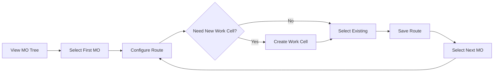
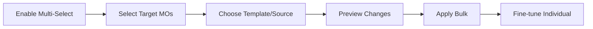
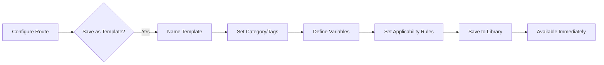
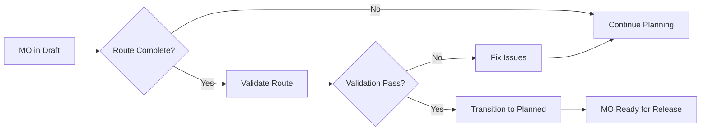

# Core Planning UI Specification

## Overview

The Core Planning UI is a comprehensive interface that enables users to simultaneously visualize manufacturing orders (MOs), configure routing steps, and manage work cells in a unified, intuitive environment. This document specifies the design and functionality of this critical planning interface.

**Important Distinction**: This UI focuses on PLANNING (defining what work is done where) and not SCHEDULING (defining when work is done). The planning phase establishes:
- Which steps are needed for each MO
- Which work cells will perform each step  
- What sequence the steps follow
- What are the requirements that need to be met before a MO step can be initiated
- What templates to be reused

Scheduling (time slots, capacity allocation, etc.) is handled in a separate system after planning is complete.

## Goals

1. **Unified Planning Experience**: Combine MO visualization, route building, and work cell management in a single interface
2. **Efficiency**: Minimize context switching and enable bulk operations
3. **Visual Clarity**: Provide clear visual feedback on planning completeness
4. **State Management**: Enable proper workflow transitions (Draft → Planned)
5. **Real-time Validation**: Immediate feedback on planning decisions
6. **Pre-Production Focus**: All features designed for the planning phase before execution begins

## Layout Architecture

### Primary Layout: Split-Panel Master-Detail View

```
┌─────────────────────────────────────────────────────────────────────────┐
│                         Header Bar                                       │
│  - Breadcrumb Navigation                                                │
│  - Global Actions Toolbar                                               │
│  - User/Session Info                                                    │
├─────────────────────┬───────────────────────────────────────────────────┤
│                     │                                                   │
│   MO Tree Panel     │        Detail/Action Panel                       │
│   (30-40% width)    │        (60-70% width)                           │
│                     │                                                   │
│   [Resizable]       │   [Context-sensitive content area]              │
│                     │                                                   │
└─────────────────────┴───────────────────────────────────────────────────┘
```

### Panel Specifications

#### Left Panel: MO Tree Visualization
- **Width**: 30-40% of screen (user adjustable)
- **Min Width**: 350px
- **Components**: 
  - ManufacturingOrderHierarchicalView (enhanced version)
  - Search/Filter bar
  - View mode toggles (thumbnail image ON/OF)
  - Bulk selection controls

#### Right Panel: Context-Sensitive Detail View
- **Width**: 60-70% of screen
- **Content Types**:
  1. Route Builder (when MO selected)
  2. Work Cell Manager (when in work cell mode)
  3. Bulk Operations Interface
  4. Template Browser/Editor (when in template mode)

## Component Enhancements

### 1. Enhanced MO Tree (ManufacturingOrderHierarchicalView)

#### Visual Indicators
- **Route Configuration Status**: Visual badges showing planning completeness
- **Color Coding System**:
  ```
  - 🟢 Green: Fully routed and ready (all steps configured)
  - 🟡 Yellow: Route in progress (some steps configured)
  - 🔴 Red: No route configured
  - 🔵 Blue: Currently editing
  - 🟣 Purple: Has validation warnings
  ```
- **State Badges**: 
  - `DRAFT` - MO created but not fully planned
  - `PLANNED` - Route configured, MO planned and ready for scheduling

#### Quick Stats Badges
- Format: `[configured steps/required steps]`
- Example: `[3/5]` indicates 3 of 5 steps configured
- Tooltip shows detailed breakdown
- Checkmark (✓) when fully configured

#### State Transition Actions
- **Draft → Planned**: Button appears when route is saved
- **Validation Required**: Must pass all checks before transition
- **Bulk Transition**: Select multiple MOs to transition together
- **Undo Capability**: Can revert from Planned back to Draft if needed

#### Interactive Features
- **Right-click Context Menu**:
  - Apply route template
  - Copy route
  - Paste route
  - Clone to children
  - **Mark as Planned** (when route complete)
  - **Revert to Draft** (if in Planned state)
  - Lock/Unlock for editing
  - View details
  - Export route

### 2. Integrated Route Builder

#### Seamless Work Cell Creation
- **In-line Creation**: 
  - "+" button in work cell dropdown
  - Opens CreateWorkCellSheet as side sheet
  - Auto-selects newly created work cell
  - No context loss

#### Seamless Route Template Management
- **Template Creation from Current Route**:
  - "Save as Template" button in route builder toolbar
  - Quick template naming and categorization
  - Option to set as default for item category
  - Immediate availability in template list

- **In-line Template Editing**:
  - "Edit Template" mode in route builder
  - Shows template metadata (usage count, last used)
  - Version control with change history
  - Apply changes to existing routes option

- **Template Library Panel**:
  - Slide-out panel with template browser
  - Search by name, category, or item type
  - Preview template steps before applying
  - Usage statistics and success rates

#### Visual Route Flow
- Enhanced step visualization with:
  - Work cell thumbnails
  - Setup and cycle time parameters
  - Step type indicators
  - Dependency lines
  - Template indicator badges

#### Smart Suggestions
- Suggested templates based on Item Type

## User Workflows

### Workflow 1: Sequential MO Planning



### Workflow 2: Bulk Route Application



### Workflow 4: Route Template Creation



### Workflow 3: Work Cell-Centric Planning


### Workflow 5: MO State Transitions



## Advanced Features

### 1. Route Copying & Reuse

- **Quick Route Operations**:
  - Copy entire route from one MO to another
  - Clone route to child MOs
  - Export/Import route configurations
  - Batch apply routes to similar items

### 2. Route Template System

#### Template Creation & Management
- **Quick Template Creation**:
  - One-click "Save as Template" from any configured route
  - Inline template editor without leaving planning UI
  - Template preview with step details
  - Template versioning and change tracking

- **Template Variables**:
  - Define variable parameters (e.g., {{quantity}}, {{work_cell}})
  - Set default values and constraints
  - Auto-calculation rules for time estimates
  - Conditional steps based on item attributes

- **Template Organization**:
  - Search by name, description, or usage
  - Favorite templates for quick access

#### Smart Template Application
- **Template Matching**:
  - AI-suggested templates based on item characteristics
  - Compatibility scoring (0-100%)
  - "Best Match" indicator with explanation
  - Previous usage history for similar items

- **Batch Template Operations**:
  - Apply template to multiple MOs with preview
  - Smart parameter substitution
  - Exception handling for incompatible MOs
  - Rollback capability

### 4. MO State Management

#### State Transitions
- **Draft → Planned**:
  - Requires complete route configuration
  - All validation checks must pass
  - User must have appropriate permissions
  - Timestamp and user recorded

- **Planned → Draft** (Revert):
  - Available for corrections/updates
  - Preserves route configuration
  - Adds note to audit trail
  - Requires justification

#### Bulk State Operations
- **Select Multiple MOs**:
  - Filter by current state
  - Validate all at once
  - Transition together
  - Show summary of results
- **Apply State Transition to All Child-MOs**:
  - Validate all at once
  - Transition together
  - Show summary of results

#### Visual State Indicators
- **Tree Node Badges**:
  - `DRAFT` - Gray background
  - `PLANNED` - Green background
  - State icon next to MO number
  - Tooltip shows transition history

### 5. Collaboration Features

#### Change Tracking
- **Activity Log**:
  - Who changed what and when
  - State transitions recorded
  - Ability to revert changes
  - Compare versions
  - Export change report

## UI Controls and Interactions

### Global Toolbar Actions

```
[Save All] [Validate] [Mark as Planned] [Templates] [Undo|Redo] [View: Tree|List|Work Cell] [Export] [Help]
```

### Template Management UI Components

#### Template Browser (Slide-out Panel)
```
┌─────────────────────────────────────┐
│ Templates Library         [✕ Close] │
├─────────────────────────────────────┤
│ 🔍 Search templates...              │
│                                     │
│ Categories        Sort by: [Most Used ▼]│
│ ├─ 📁 Machining (23)               │
│ │  ├─ 📁 Turning (12)              │
│ │  └─ 📁 Milling (11)              │
│ ├─ 📁 Assembly (15)                │
│ └─ 📁 Quality Control (8)          │
│                                     │
│ ┌─────────────────────────────────┐ │
│ │ Template: Standard Turning      │ │
│ │ ⭐⭐⭐⭐☆ (4.2) | Used 156 times  │ │
│ │ 5 steps | ~45 min | 3 work cells│ │
│ │ [Preview] [Apply] [Edit]        │ │
│ └─────────────────────────────────┘ │
└─────────────────────────────────────┘
```

#### Quick Template Creation Dialog
```
┌─────────────────────────────────────┐
│ Save Route as Template              │
├─────────────────────────────────────┤
│ Template Name:                      │
│ [________________________]          │
│                                     │
│ Category: [Select Category ▼]       │
│                                     │
│ Description:                        │
│ [________________________]          │
│ [________________________]          │
│                                     │
│ ☑ Make available for similar items │
│ ☑ Include current work cells       │
│ ☐ Set as default for this item type│
│                                     │
│ Tags: #turning #small-parts +Add    │
│                                     │
│ [Cancel] [Save as Draft] [Save]     │
└─────────────────────────────────────┘
```

### Keyboard Shortcuts

| Shortcut | Action |
|----------|--------|
| Ctrl+S | Save current changes |
| Ctrl+Shift+S | Save route as template |
| Ctrl+Z/Y | Undo/Redo |
| Ctrl+C/V | Copy/Paste route |
| Ctrl+T | Open template browser |
| Ctrl+Shift+T | Quick apply last template |
| Ctrl+Tab | Switch between pinned MOs |
| F2 | Rename current element |
| ESC | Close modal/Cancel operation |
| Space | Toggle MO selection |
| Ctrl+A | Select all visible MOs |

### Mouse Interactions

- **Single Click**: Select MO/Show route
- **Double Click**: Open details modal
- **Right Click**: Context menu
- **Drag**: Reorder/Compare/Assign
- **Hover**: Show tooltips/previews
- **Scroll**: Navigate tree/route steps

## Responsive Design

### Desktop (>1200px)
- Full split-panel layout
- All features available
- Optimal experience

### Tablet (768px-1200px)
- Collapsible left panel
- Floating panel option
- Touch-optimized controls

### Mobile (<768px)
- No mobile view
- Inform user the need for larger screen

## Performance Considerations

### Loading Strategy
- **Lazy Loading**: Load MO details on demand
- **Virtual Scrolling**: For large MO lists
- **Pagination**: Work cells and routes
- **Caching**: Recent routes and templates

### State Management
- **Auto-save**: Every 30 seconds for draft changes
- **Local Storage**: Temporary state preservation
- **Optimistic Updates**: Immediate UI feedback
- **Conflict Resolution**: Last-write-wins with warnings

## Visual Design System

### Colors
- **Primary Actions**: Blue (#3B82F6)
- **Success States**: Green (#10B981)
- **Warnings**: Yellow (#F59E0B)
- **Errors**: Red (#EF4444)
- **Neutral**: Gray scale
- **Work Cell Types**: Custom palette

### Typography
- **Headers**: Inter/System font, 16-24px
- **Body**: Inter/System font, 14px
- **Small Text**: 12px for badges/labels

### Spacing
- **Grid**: 8px base unit
- **Panels**: 24px padding
- **Cards**: 16px padding
- **Compact Mode**: 12px padding

## Implementation Priorities

### Phase 1: Core Functionality
1. Basic split-panel layout
2. MO tree with status indicators
3. Integrated route builder
4. Simple work cell selection
5. Basic template save/apply

### Phase 2: Enhanced Features
1. Multi-select and bulk operations
2. Inline work cell creation
3. Template browser and management
4. Quick stats and progress bars
5. Context menus
6. Template categories and search

### Phase 3: Advanced Features
1. Template variables and smart matching
2. Auto-routing wizard
3. Planning sessions (collaboration)
4. Work cell map view
5. Template analytics
6. Route optimization suggestions

### Phase 4: Optimization
1. Collaboration features
2. AI-powered suggestions
3. Template versioning
4. Advanced analytics

## Success Metrics

1. **Time to Plan**: Reduce average time from MO creation to "Planned" state by 50%
2. **Planning Completeness**: 95% of MOs reaching "Planned" state before release
3. **Template Reuse**: 70% of routes created using templates
4. **First-Time Success**: 85% of MOs pass validation on first attempt
5. **State Transition Time**: Average < 2 days from Draft to Planned
6. **User Satisfaction**: >4.5/5 user rating
7. **Adoption Rate**: 90% of planners using new UI within 30 days

## Access Control and Permissions

### Overview

The Core Planning UI leverages existing production module permissions to control access to planning features. No new permissions are required - the system uses the comprehensive production permissions already defined in the system.

### Permission Requirements by Feature

#### 1. Manufacturing Order Tree View
- **View MO Tree**: Requires `production.orders.viewAny` and `production.orders.view`
- **View Route Status**: Requires `production.routes.view`
- **State Badges**: Visible to all users with view permissions

#### 2. Route Configuration
- **View Routes**: Requires `production.routes.view`
- **Create Routes**: Requires `production.routes.create`
- **Edit Routes**: Requires `production.routes.update`
- **Delete Routes**: Requires `production.routes.delete`
- **Apply Templates**: Requires `production.routes.createFromTemplate`

#### 3. Work Cell Management
- **View Work Cells**: Requires `production.work-cells.view`
- **Create Work Cells**: Requires `production.work-cells.create`
- **Edit Work Cells**: Requires `production.work-cells.update`
- **View Work Cell Dashboard**: Requires `production.work-cells.viewDashboard`

#### 4. State Transitions
- **Draft → Planned**: Requires `production.orders.plan`
- **Planned → Draft (Revert)**: Requires `production.orders.update`
- **Bulk Transitions**: Requires same permissions as individual transitions

#### 5. Template Management
- **Create Templates**: Requires `production.routes.create`
- **Apply Templates**: Requires `production.routes.createFromTemplate`
- **Edit Templates**: Requires `production.routes.update`
- **Delete Templates**: Requires `production.routes.delete`

#### 6. Export/Import Features
- **Export Routes**: Requires `production.work-cells.exportData`
- **Import Templates**: Requires `production.routes.create`

### Role-Based Access

#### Administrator
- Full access to all planning features
- Can perform all state transitions
- Can manage all templates and routes
- Can create/edit/delete work cells

#### Plant Manager
- Full planning access within assigned plants
- Can create/edit routes and work cells
- Can transition MOs to Planned state
- Can manage templates

#### Maintenance Supervisor
- Can view and plan maintenance-related MOs
- Can create/edit routes for maintenance orders
- Can transition maintenance MOs to Planned
- Limited to maintenance work cells

#### Planner
- Primary user of the Core Planning UI
- Can view all MOs and routes
- Can create/edit routes and apply templates
- Can plan MOs (transition to Planned state)
- Cannot create work cells (view only)

#### Technician
- Read-only access to planning interface
- Can view MOs and routes
- Can view work cell assignments
- Cannot make any modifications

#### Viewer
- Read-only access to all planning features
- Can view MO tree and route configurations
- Cannot perform any actions

### Feature Access Matrix

| Feature | Administrator | Plant Manager | Maintenance Supervisor | Planner | Technician | Viewer |
|---------|--------------|---------------|----------------------|---------|------------|---------|
| View MO Tree | ✓ | ✓ | ✓ | ✓ | ✓ | ✓ |
| Create Routes | ✓ | ✓ | ✓ | ✓ | ✗ | ✗ |
| Edit Routes | ✓ | ✓ | ✓ | ✓ | ✗ | ✗ |
| Delete Routes | ✓ | ✓ | ✓ | ✗ | ✗ | ✗ |
| Create Work Cells | ✓ | ✓ | ✓ | ✗ | ✗ | ✗ |
| Apply Templates | ✓ | ✓ | ✓ | ✓ | ✗ | ✗ |
| Transition to Planned | ✓ | ✓ | ✓ | ✓ | ✗ | ✗ |
| Bulk Operations | ✓ | ✓ | ✓ | ✓ | ✗ | ✗ |
| Export Data | ✓ | ✓ | ✓ | ✓ | ✗ | ✗ |

### UI Element Visibility

#### Conditional Display Rules
1. **Action Buttons**: Only shown if user has required permission
2. **Context Menus**: Items filtered based on permissions
3. **Toolbar Actions**: Disabled/hidden based on role
4. **State Transition Buttons**: Only shown if user can perform transition

#### Read-Only Mode
Users without edit permissions see:
- Disabled form fields
- Hidden edit/delete buttons
- No drag-and-drop functionality
- View-only context menus

### Permission Checks in Code

```typescript
// Example permission checks for UI elements
const canCreateRoute = user.can('production.routes.create');
const canEditRoute = user.can('production.routes.update');
const canPlanOrder = user.can('production.orders.plan');
const canCreateWorkCell = user.can('production.work-cells.create');

// Conditional rendering
{canCreateRoute && <Button onClick={createRoute}>Create Route</Button>}
{canPlanOrder && <Button onClick={transitionToPlanned}>Mark as Planned</Button>}
```

### Audit Trail

All planning actions are logged with:
- User performing the action
- Timestamp
- Previous and new values
- Related entities (MO, Route, Work Cell)

Viewing audit logs requires:
- `system.audit.view` for system-wide logs
- Or entity-specific view permissions

## Open Questions

1. How to handle very large MO hierarchies (>1000 nodes)?
2. Should template creation require a separate permission or use existing route permissions?
3. How to handle permission inheritance for child MOs in bulk operations?

