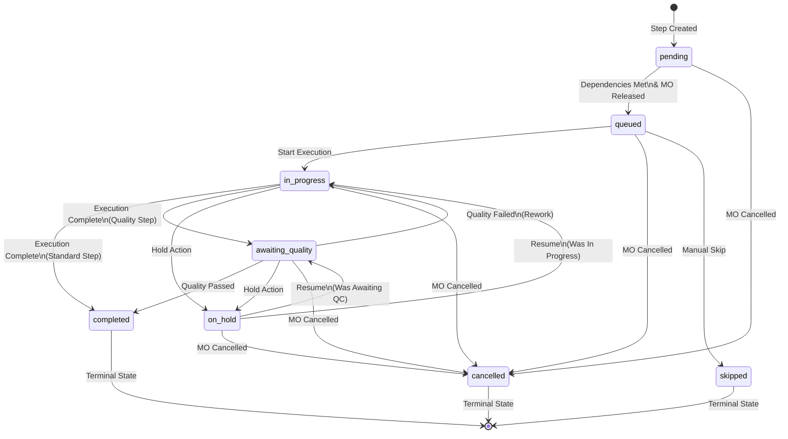

# Manufacturing Step States and Transitions Documentation

This document provides comprehensive documentation of all possible states and state transitions for Manufacturing Steps in the Production Module.

## Overview

Manufacturing Steps represent individual operations within a Manufacturing Route. Each step tracks its own execution status through a defined state machine with specific transition rules and conditions.

## Step States

### 1. **pending** (Initial State)
- **Description**: Initial state when a step is created
- **Entry Conditions**: 
  - Automatically set when a Manufacturing Route is created
  - Default state for new steps
- **Behavior**:
  - Step is waiting for dependencies to be met
  - Cannot be executed
  - No resource allocation

### 2. **queued**
- **Description**: Step is ready to execute (dependencies met, MO is released)
- **Entry Conditions**:
  - Manufacturing Order status must be 'released' or 'in_progress'
  - All step dependencies must be satisfied:
    - Previous step dependency conditions met based on `dependency_start_condition`
    - Child order dependencies satisfied based on `child_order_dependency_type`
  - Step must pass `canStart()` validation
- **Behavior**:
  - Step is available for execution
  - Appears in work cell queues
  - Can be selected by operators

### 3. **in_progress**
- **Description**: Step is currently being executed
- **Entry Conditions**:
  - Step must be in 'queued' state (or 'pending' with immediate transition if dependencies met)
  - Operator must start execution
  - Work cell assignment verified
- **Behavior**:
  - Active execution record created
  - Time tracking begins (`actual_start_time` set)
  - Progress can be reported
  - Photos can be captured
  - Resource is allocated to work cell

### 4. **on_hold**
- **Description**: Temporarily paused (follows parent MO status)
- **Entry Conditions**:
  - Step must be in 'in_progress' or 'awaiting_quality' state
  - Manufacturing Order put on hold OR
  - Manual hold applied to step
- **Behavior**:
  - Execution is paused
  - Time tracking suspended
  - Maintains previous state information for resume
  - Resources freed temporarily

### 5. **awaiting_quality**
- **Description**: Step execution complete, waiting for quality check results
- **Entry Conditions**:
  - Step must be of type 'quality_check'
  - Step must be in 'in_progress' state
  - Execution marked as complete without quality result
- **Behavior**:
  - Physical execution complete
  - Waiting for quality inspection
  - Cannot proceed until quality result recorded
  - Quality forms may be required

### 6. **completed** (Terminal State)
- **Description**: Step successfully finished (including passed quality checks)
- **Entry Conditions**:
  - For standard steps: Execution completed with required quantities
  - For quality_check steps: Quality result = 'passed'
  - Cumulative quantities meet order requirements
- **Behavior**:
  - `actual_end_time` is set
  - Triggers dependency checks for subsequent steps
  - Updates cumulative quantities on order
  - May trigger parent order progress

### 7. **skipped** (Terminal State)
- **Description**: Step was bypassed (not executed)
- **Entry Conditions**:
  - Manual skip action by authorized user
  - Currently must be set via `updateStatus` method
  - Step must not be in 'completed' or 'cancelled' state
- **Behavior**:
  - Step is marked as not required
  - Dependencies treating this step are satisfied
  - No execution records created
  - No time or quantity tracking

### 8. **cancelled** (Terminal State)
- **Description**: Parent manufacturing order was cancelled
- **Entry Conditions**:
  - Manufacturing Order status changed to 'cancelled'
  - Step must not be 'completed'
- **Behavior**:
  - Step cannot be executed
  - Any in-progress executions are terminated
  - Resources are freed
  - Cannot be resumed

## State Transitions

### Valid State Transitions Matrix

| From State | To State | Method/Trigger | Conditions |
|------------|----------|----------------|------------|
| pending | queued | `moveToQueued()` | Dependencies met, MO released |
| pending | cancelled | `cancel()` | MO cancelled |
| queued | in_progress | `startExecution()` | Operator starts, work cell verified |
| queued | cancelled | `cancel()` | MO cancelled |
| queued | skipped | `updateStatus()` | Manual skip |
| in_progress | awaiting_quality | `moveToAwaitingQuality()` | Quality check step, execution complete |
| in_progress | completed | `complete()` | Standard step, quantities met |
| in_progress | on_hold | `putOnHold()` | MO on hold or manual hold |
| in_progress | cancelled | `cancel()` | MO cancelled |
| awaiting_quality | completed | `recordQualityResult()` | Quality passed |
| awaiting_quality | on_hold | `putOnHold()` | MO on hold |
| awaiting_quality | cancelled | `cancel()` | MO cancelled |
| on_hold | in_progress | `resumeFromHold()` | Resume action, was in progress |
| on_hold | awaiting_quality | `resumeFromHold()` | Resume action, was awaiting quality |
| on_hold | cancelled | `cancel()` | MO cancelled |

### Transition Rules and Guards

#### 1. **pending → queued**
```php
public function moveToQueued(): bool
{
    // Only pending steps can be queued
    if ($this->status !== 'pending') {
        return false;
    }
    
    // Check if dependencies are met
    if (!$this->canStart()) {
        return false;
    }
    
    $this->update(['status' => 'queued']);
    return true;
}
```

#### 2. **queued → in_progress**
```php
public function startExecution($partNumber = null, $totalParts = null): ManufacturingStepExecution
{
    if (!$this->canStart()) {
        throw new \Exception('Step dependencies not met');
    }
    
    $this->update([
        'status' => 'in_progress',
        'actual_start_time' => now(),
    ]);
    
    // Create execution record
    return ManufacturingStepExecution::create([...]);
}
```

#### 3. **in_progress → completed**
```php
public function complete(): void
{
    $this->update([
        'status' => 'completed',
        'actual_end_time' => now(),
    ]);
    
    // Check and queue dependent steps
    $this->checkAndQueueDependentSteps();
    
    // Update parent order if last step
    if ($this->isLastStep()) {
        $this->checkOrderCompletion();
    }
}
```

## Dependency-Based State Control

### Step Dependencies (`depends_on_step_id`)

Steps can depend on other steps with different start conditions:

1. **completed**: Traditional batch - wait for full completion
2. **quantity_based**: Start after X units completed
3. **percentage_based**: Start after X% completed  
4. **immediate**: Start as soon as dependency begins

### Child Order Dependencies (`child_order_dependency_type`)

Steps can wait for child Manufacturing Orders:

1. **none**: No child order dependencies
2. **all_children_completed**: All child orders must be completed
3. **children_quantity**: Minimum quantity from child orders required

### Dependency Validation
```php
public function canStart(): bool
{
    // Check step dependencies first
    if (!$this->checkStepDependencies()) {
        return false;
    }
    
    // Then check child order dependencies
    if (!$this->checkChildOrderDependencies()) {
        return false;
    }
    
    return true;
}
```

## Special State Behaviors

### Quality Check Steps
- Type: `quality_check`
- Flow: `in_progress` → `awaiting_quality` → `completed` or `rework`
- Quality results: `passed` or `failed`
- Failure actions: `scrap` or `rework`

### Rework Steps
- Type: `rework`
- Created dynamically when quality check fails with `rework` action
- Automatically queued when parent quality step fails

### Progressive Flow Support
- Steps track cumulative quantities: `cumulative_quantity_completed`, `cumulative_quantity_scrapped`
- Enables overlapping execution between steps
- Supports partial batch processing

### On Hold Behavior
- Preserves previous state for proper resume
- Tracks hold duration for metrics
- Cascades from Manufacturing Order status

## State Transition Events

### State Change Triggers

1. **Automatic Triggers**
   - MO Release → Queue first steps
   - Step completion → Check and queue dependent steps
   - MO cancellation → Cancel all non-completed steps
   - MO hold → Hold all active steps

2. **Manual Triggers**
   - Start execution (operator action)
   - Report progress
   - Record quality result
   - Skip step
   - Update status (admin)

3. **System Triggers**
   - Dependency satisfaction → Move to queued
   - Quantity thresholds met → Complete step
   - Child order progress → Update dependencies

## Implementation Notes

### State Persistence
- States are stored in `manufacturing_steps.status` column
- Enum validation at database level
- Model-level state transition methods ensure consistency

### Audit Trail
- State changes can be tracked via Laravel activity log
- Execution records maintain detailed history
- Timestamps track state durations

### Concurrency Control
- Database transactions protect state transitions
- Status checks prevent invalid transitions
- Execution uniqueness prevents duplicate runs

## State Diagram



## Best Practices

1. **State Validation**: Always use model methods for state transitions rather than direct updates
2. **Dependency Checks**: Validate dependencies before state changes
3. **Transaction Safety**: Wrap complex state transitions in database transactions
4. **Error Handling**: Provide clear error messages for invalid transitions
5. **Audit Logging**: Track all state changes for traceability
6. **Progressive Flow**: Consider partial completion scenarios when designing workflows

## Future Considerations

1. **Additional States**: 
   - `blocked`: Explicitly blocked by external factor
   - `waiting_material`: Waiting for material availability
   
2. **Enhanced Transitions**:
   - Automatic retry mechanisms
   - Conditional routing based on execution results
   - Time-based automatic transitions

3. **Metrics Integration**:
   - State duration tracking
   - State transition frequency analysis
   - Bottleneck identification
