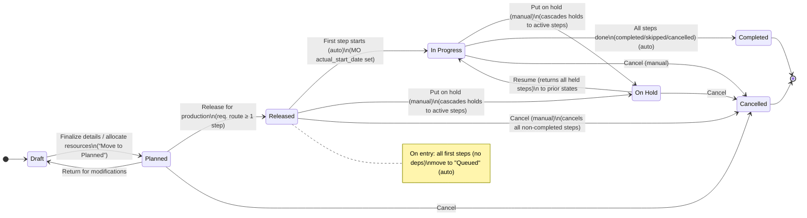
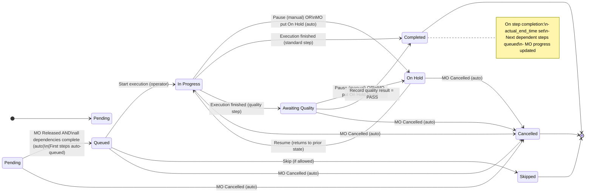

# Manufacturing States and Transitions

This document consolidates the **Manufacturing Order** and **Manufacturing Step** state diagrams into a single file.

---

## Manufacturing Orders — States & Transitions

---

## Manufacturing Steps — States & Transitions

