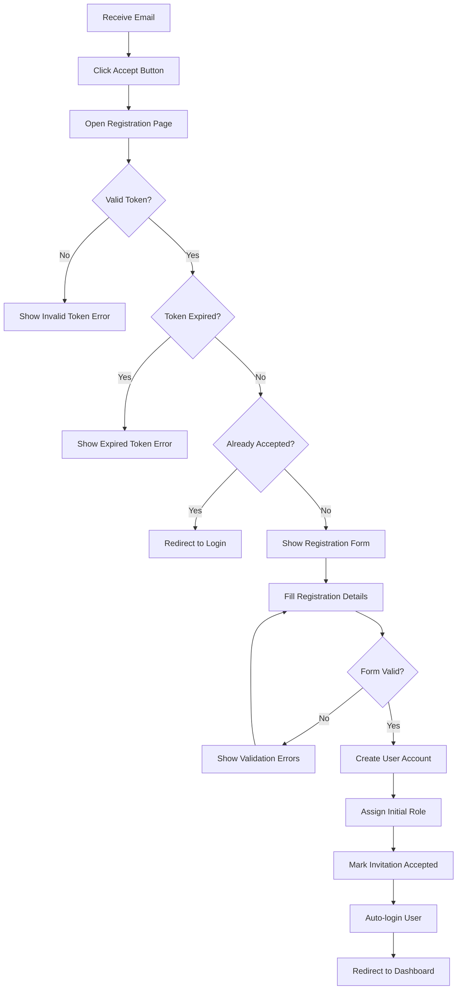
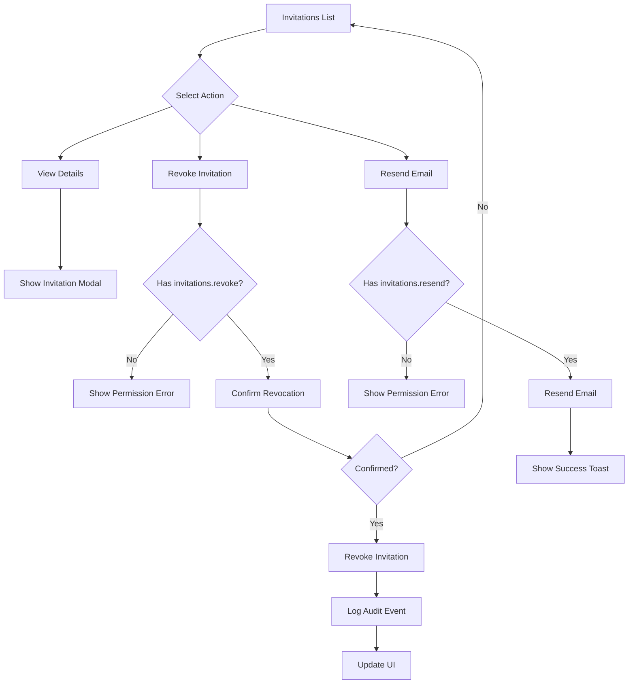

# User Invitation System UI Specification

## Table of Contents
1. [Overview](#overview)
2. [System Requirements](#system-requirements)
3. [User Flows](#user-flows)
4. [UI Components](#ui-components)
5. [Permission Requirements](#permission-requirements)
6. [Data Models & API](#data-models--api)
7. [Security Considerations](#security-considerations)
8. [Error Handling](#error-handling)
9. [Email Templates](#email-templates)
10. [Acceptance Criteria](#acceptance-criteria)

## Overview

The User Invitation System is a critical component of the maintenance OS that enforces controlled user access. Only system administrators with the appropriate permissions can invite new users via secure, time-limited email invitations. This document specifies the complete UI requirements for implementing this system.

### Key Features
- **Invitation-Only Registration**: Public registration is disabled after the first user
- **Role-Based Invitation**: Administrators can pre-assign roles to invitees
- **Time-Limited Tokens**: Invitations expire after 7 days by default
- **Comprehensive Management**: View, revoke, and resend invitations
- **Audit Trail**: All invitation actions are logged
- **Email Notifications**: Professional invitation emails with secure links

### Referenced Permissions
From the permissions system, the following permissions control invitation functionality:
- `users.invite` - Send user invitations
- `invitations.viewAny` - View all invitations
- `invitations.view` - View invitation details
- `invitations.create` - Send new invitations (same as users.invite)
- `invitations.revoke` - Revoke pending invitations
- `invitations.resend` - Resend invitation emails

## System Requirements

### Technical Stack
- **Frontend**: React with TypeScript
- **UI Framework**: shadcn/ui components
- **State Management**: Inertia.js for server-state
- **Form Handling**: Inertia forms with validation
- **Date Handling**: date-fns for formatting
- **Icons**: Lucide React icons

### Browser Support
- Chrome (latest 2 versions)
- Firefox (latest 2 versions)
- Safari (latest 2 versions)
- Edge (latest 2 versions)

### Responsive Design
- Mobile: 320px - 768px
- Tablet: 768px - 1024px
- Desktop: 1024px+

## User Flows

### 1. Administrator Inviting a New User

```mermaid
graph TD
    A[Admin Dashboard] --> B[Navigate to Users/Invitations]
    B --> C{Has users.invite permission?}
    C -->|No| D[Show Access Denied]
    C -->|Yes| E[Show Invitations List]
    E --> F[Click "Invite New User"]
    F --> G[Fill Invitation Form]
    G --> H{Form Valid?}
    H -->|No| I[Show Validation Errors]
    I --> G
    H -->|Yes| J[Submit Invitation]
    J --> K{Email Already Exists?}
    K -->|Yes| L[Show Error: User Already Exists]
    K -->|No| M{Pending Invitation Exists?}
    M -->|Yes| N[Show Warning: Invitation Already Sent]
    M -->|No| O[Create Invitation]
    O --> P[Send Email]
    P --> Q[Show Success Message]
    Q --> R[Redirect to Invitations List]
```

### 2. Invitee Accepting an Invitation



### 3. Managing Existing Invitations



## UI Components

### 1. Invitations List Page

#### Layout Structure
```
┌─────────────────────────────────────────────────────────────┐
│ Header                                                      │
│ ┌─────────────────────────────────────────────────────────┐ │
│ │ User Invitations                    [+ Invite New User] │ │
│ └─────────────────────────────────────────────────────────┘ │
│                                                             │
│ Filters & Search                                            │
│ ┌─────────────────────────────────────────────────────────┐ │
│ │ [🔍 Search by email...]  [Status ▼]  [Date Range]      │ │
│ └─────────────────────────────────────────────────────────┘ │
│                                                             │
│ Invitations Table                                           │
│ ┌─────────────────────────────────────────────────────────┐ │
│ │ Email         | Invited By | Status | Expires | Actions │ │
│ │──────────────────────────────────────────────────────── │ │
│ │ user@ex...    | Admin      | ✓ Sent | 7 days  | [...] │ │
│ │ test@ex...    | Manager    | ⚠ Exp  | -       | [...] │ │
│ └─────────────────────────────────────────────────────────┘ │
│                                                             │
│ Pagination                                                  │
└─────────────────────────────────────────────────────────────┘
```

#### Component Specifications

**Header Section**
- Title: "User Invitations" (h1, 24px, font-semibold)
- Action Button: "Invite New User" (primary button, right-aligned)
  - Icon: Plus icon (16px)
  - Only visible if user has `users.invite` permission
  - Click navigates to invitation form

**Filters Section**
- Search Input:
  - Placeholder: "Search by email or name..."
  - Real-time search with 300ms debounce
  - Searches: email, invited_by name
- Status Filter:
  - Options: All, Pending, Accepted, Expired, Revoked
  - Default: All
- Date Range:
  - Custom date picker for filtering by invitation date
  - Format: "MMM d, yyyy"

**Table Specifications**
- Columns:
  1. **Email** (sortable)
     - Display: Full email address
     - Truncate with ellipsis on mobile
  2. **Invited By**
     - Display: User name
     - Subtitle: User role (smaller, muted)
  3. **Status**
     - Badges with colors:
       - Pending: Blue badge
       - Accepted: Green badge with checkmark
       - Expired: Yellow badge with warning icon
       - Revoked: Red badge with X icon
  4. **Expires**
     - Format: Relative time (e.g., "in 5 days")
     - Show exact date on hover
     - Display "-" for expired/accepted/revoked
  5. **Actions** (dropdown menu)
     - View Details (always visible)
     - Resend Email (if pending & has permission)
     - Revoke (if pending & has permission)
     - Copy Link (if pending)

**Empty States**
- No invitations: "No invitations found. Click 'Invite New User' to get started."
- No search results: "No invitations match your search criteria."

### 2. Invite New User Form

#### Layout Structure
```
┌─────────────────────────────────────────────────────────────┐
│ < Back to Invitations                                      │
│                                                             │
│ ┌─────────────────────────────────────────────────────────┐ │
│ │                 Invite New User                         │ │
│ │                                                         │ │
│ │ Email Address *                                         │ │
│ │ ┌─────────────────────────────────────────────────────┐ │ │
│ │ │ user@example.com                                    │ │ │
│ │ └─────────────────────────────────────────────────────┘ │ │
│ │                                                         │ │
│ │ Initial Role (Optional)                                 │ │
│ │ ┌─────────────────────────────────────────────────────┐ │ │
│ │ │ Select a role...                                  ▼ │ │ │
│ │ └─────────────────────────────────────────────────────┘ │ │
│ │                                                         │ │
│ │ Personal Message (Optional)                             │ │
│ │ ┌─────────────────────────────────────────────────────┐ │ │
│ │ │ Add a personal welcome message...                   │ │ │
│ │ │                                                     │ │ │
│ │ └─────────────────────────────────────────────────────┘ │ │
│ │                                                         │ │
│ │ ℹ️ The user will receive an email with a secure link   │ │
│ │    to complete their registration. The link expires    │ │
│ │    in 7 days.                                          │ │
│ │                                                         │ │
│ │ [Cancel]                          [Send Invitation]     │ │
│ └─────────────────────────────────────────────────────────┘ │
└─────────────────────────────────────────────────────────────┘
```

#### Form Fields

**Email Address** (required)
- Type: Email input
- Validation:
  - Required
  - Valid email format
  - Not already registered
  - No pending invitation (warning)
- Error messages:
  - "Email is required"
  - "Please enter a valid email address"
  - "A user with this email already exists"
  - "An invitation has already been sent to this email"

**Initial Role** (optional)
- Type: Select dropdown
- Options: Populated from available roles
- Default: None selected
- Display format: "Role Name (X permissions)"
- Note: Only shows roles user can assign

**Personal Message** (optional)
- Type: Textarea
- Max length: 500 characters
- Rows: 3
- Character counter
- Placeholder: "Welcome to our team! We're excited to have you join us..."

**Form Actions**
- Cancel: Returns to invitations list
- Send Invitation: 
  - Shows loading state
  - Disabled during submission
  - Success: Redirect with success toast
  - Error: Show inline errors

### 3. Invitation Details Modal

```
┌─────────────────────────────────────────────────────────────┐
│ Invitation Details                                      [X] │
├─────────────────────────────────────────────────────────────┤
│                                                             │
│ Recipient: user@example.com                                │
│ Invited by: John Admin (john@company.com)                  │
│ Sent: January 15, 2024 at 2:30 PM                         │
│ Expires: January 22, 2024 at 2:30 PM                      │
│ Status: [Pending]                                          │
│                                                             │
│ Initial Role: Technician                                   │
│ Personal Message:                                          │
│ "Welcome to the team! Looking forward to working..."       │
│                                                             │
│ Invitation Link:                                           │
│ ┌─────────────────────────────────────────────────────────┐ │
│ │ https://app.com/invitations/accept/abc123...         📋 │ │
│ └─────────────────────────────────────────────────────────┘ │
│                                                             │
│ Actions:                                                   │
│ [Resend Email] [Revoke Invitation]            [Close]      │
└─────────────────────────────────────────────────────────────┘
```

### 4. Invitation Acceptance Page

```
┌─────────────────────────────────────────────────────────────┐
│                    Company Logo                             │
│                                                             │
│ ┌─────────────────────────────────────────────────────────┐ │
│ │              Complete Your Registration                 │ │
│ │                                                         │ │
│ │ You've been invited by John Admin to join              │ │
│ │ Maintenance OS. Please complete your registration.     │ │
│ │                                                         │ │
│ │ Email (read-only)                                      │ │
│ │ ┌─────────────────────────────────────────────────────┐ │ │
│ │ │ user@example.com                              🔒    │ │ │
│ │ └─────────────────────────────────────────────────────┘ │ │
│ │                                                         │ │
│ │ Full Name *                                            │ │
│ │ ┌─────────────────────────────────────────────────────┐ │ │
│ │ │ Jane Smith                                         │ │ │
│ │ └─────────────────────────────────────────────────────┘ │ │
│ │                                                         │ │
│ │ Password *                                             │ │
│ │ ┌─────────────────────────────────────────────────────┐ │ │
│ │ │ ••••••••••••                                       │ │ │
│ │ └─────────────────────────────────────────────────────┘ │ │
│ │ Password Requirements:                                 │ │
│ │ ✓ At least 8 characters                               │ │
│ │ ✓ One uppercase letter                                │ │
│ │ ✓ One number                                          │ │
│ │                                                         │ │
│ │ Confirm Password *                                     │ │
│ │ ┌─────────────────────────────────────────────────────┐ │ │
│ │ │ ••••••••••••                                       │ │ │
│ │ └─────────────────────────────────────────────────────┘ │ │
│ │                                                         │ │
│ │ [Complete Registration]                                │ │
│ └─────────────────────────────────────────────────────────┘ │
└─────────────────────────────────────────────────────────────┘
```

### 5. Status Messages & Toasts

**Success Messages**
- "Invitation sent successfully to {email}"
- "Invitation revoked successfully"
- "Invitation email resent to {email}"
- "Registration completed successfully. Welcome!"

**Error Messages**
- "Failed to send invitation. Please try again."
- "This invitation link is invalid or has expired."
- "This invitation has already been accepted."
- "You don't have permission to perform this action."

**Warning Messages**
- "An invitation was already sent to this email {time} ago. Do you want to send a new one?"
- "This invitation will expire in {days} days."

## Permission Requirements

### Page Access
| Page/Component | Required Permission | Fallback |
|----------------|-------------------|----------|
| Invitations List | `invitations.viewAny` or `users.invite` | 403 Error |
| Create Invitation | `users.invite` | Hide button |
| Invitation Details | `invitations.view` | 403 Error |
| Revoke Action | `invitations.revoke` | Hide/disable |
| Resend Action | `invitations.resend` | Hide/disable |

### Conditional UI Elements
```typescript
// Example permission checks
<PermissionGuard permission="users.invite">
  <Button>Invite New User</Button>
</PermissionGuard>

<PermissionGuard permission="invitations.revoke">
  <MenuItem onClick={handleRevoke}>Revoke Invitation</MenuItem>
</PermissionGuard>
```

## Data Models & API

### Invitation Model
```typescript
interface UserInvitation {
  id: number;
  email: string;
  token: string;
  invited_by: {
    id: number;
    name: string;
    email: string;
  };
  initial_role?: string;
  initial_permissions?: string[];
  personal_message?: string;
  expires_at: string;
  accepted_at?: string;
  accepted_by?: number;
  revoked_at?: string;
  revoked_by?: {
    id: number;
    name: string;
  };
  revocation_reason?: string;
  created_at: string;
  updated_at: string;
}
```

### API Endpoints

**List Invitations**
```
GET /invitations
Query params: 
  - search: string
  - status: pending|accepted|expired|revoked
  - date_from: YYYY-MM-DD
  - date_to: YYYY-MM-DD
  - page: number
  - per_page: number
```

**Create Invitation**
```
POST /invitations
Body: {
  email: string,
  initial_role?: string,
  personal_message?: string
}
```

**Get Invitation Details**
```
GET /invitations/{id}
```

**Revoke Invitation**
```
POST /invitations/{id}/revoke
Body: {
  reason?: string
}
```

**Resend Invitation**
```
POST /invitations/{id}/resend
```

**Accept Invitation (Public)**
```
GET /invitations/accept/{token}
POST /invitations/accept/{token}
Body: {
  name: string,
  password: string,
  password_confirmation: string
}
```

## Security Considerations

### Token Security
- Tokens are 64 characters, cryptographically secure
- One-time use - marked as used after acceptance
- Time-limited - expire after 7 days
- Signed URLs prevent tampering

### Rate Limiting
- Invitation creation: 10 per minute per user
- Invitation acceptance: 3 attempts per token
- Email resend: 1 per hour per invitation

### Validation Rules
```typescript
// Frontend validation
const invitationSchema = {
  email: z.string().email().required(),
  initial_role: z.string().optional(),
  personal_message: z.string().max(500).optional()
};

// Registration validation
const registrationSchema = {
  name: z.string().min(2).max(255).required(),
  password: z.string()
    .min(8)
    .regex(/[A-Z]/, "Must contain uppercase")
    .regex(/[0-9]/, "Must contain number")
    .required(),
  password_confirmation: z.string().required()
}.refine(data => data.password === data.password_confirmation, {
  message: "Passwords must match",
  path: ["password_confirmation"]
});
```

### Security Headers
- CSRF protection on all forms
- Content Security Policy
- X-Frame-Options: DENY
- Secure session cookies

## Error Handling

### User-Friendly Error Messages
| Error Code | User Message | Technical Details |
|------------|--------------|-------------------|
| 409 | "A user with this email already exists" | Duplicate email constraint |
| 410 | "This invitation has expired" | Token past expiry date |
| 403 | "You don't have permission to send invitations" | Missing users.invite permission |
| 404 | "This invitation link is invalid" | Token not found |
| 422 | "Please check the form for errors" | Validation failed |
| 429 | "Too many attempts. Please try again later" | Rate limit exceeded |

### Error Recovery
- Form errors: Preserve user input
- Network errors: Retry with exponential backoff
- Expired tokens: Suggest admin contact
- Permission errors: Show help text

## Email Templates

### Invitation Email
```html
Subject: You're invited to join {Company Name}

Hello!

{InviterName} has invited you to join {Company Name}'s Maintenance Management System.

{PersonalMessage}

To complete your registration, please click the button below:

[Accept Invitation - Button]

This invitation will expire on {ExpiryDate}.

If you have any questions, please contact your administrator.

Best regards,
The {Company Name} Team

---
This invitation was sent to {Email}. If you did not expect this invitation, you can safely ignore this email.
```

### Design Requirements
- Responsive email template
- Clear CTA button
- Company branding
- Plain text fallback
- Unsubscribe footer

## Acceptance Criteria

### Functional Requirements
- [ ] Public registration disabled after first user
- [ ] Only users with `users.invite` permission can send invitations
- [ ] Invitations expire after 7 days
- [ ] Each invitation can only be used once
- [ ] Email validation prevents duplicate users
- [ ] Invitees can be assigned initial roles
- [ ] All invitation actions are logged in audit trail
- [ ] Administrators can view all invitations
- [ ] Administrators can revoke pending invitations
- [ ] Administrators can resend invitation emails

### UI/UX Requirements
- [ ] Responsive design works on all specified devices
- [ ] Loading states for all async operations
- [ ] Clear error messages with recovery actions
- [ ] Keyboard navigation support
- [ ] Screen reader compatibility
- [ ] Success confirmations for all actions
- [ ] Intuitive empty states
- [ ] Consistent with existing UI patterns

### Performance Requirements
- [ ] Page load time < 3 seconds
- [ ] Search results update < 500ms
- [ ] Form submission < 2 seconds
- [ ] Email delivery < 30 seconds

### Security Requirements
- [ ] All endpoints require authentication (except acceptance)
- [ ] Permissions properly enforced
- [ ] Rate limiting implemented
- [ ] Tokens are secure and time-limited
- [ ] CSRF protection on all forms
- [ ] Input validation on client and server
- [ ] XSS protection for user inputs

### Testing Requirements
- [ ] Unit tests for all components
- [ ] Integration tests for workflows
- [ ] E2E tests for critical paths
- [ ] Accessibility testing
- [ ] Cross-browser testing
- [ ] Mobile device testing 